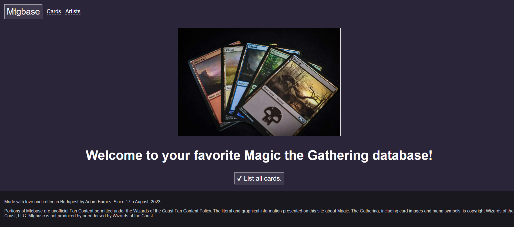

# Mtgbase

Full stack Magic the Gathering card game database, made with:

* Angular, TypeScript
* Spring Boot, Java

## Install and run

Please see how to use the frontend and backend in the subfolder docs.

* [Frontend docs](frontend/README.md)
* [Backend docs](backend/README.md)

## Screenshot

The cover page looks like this.

