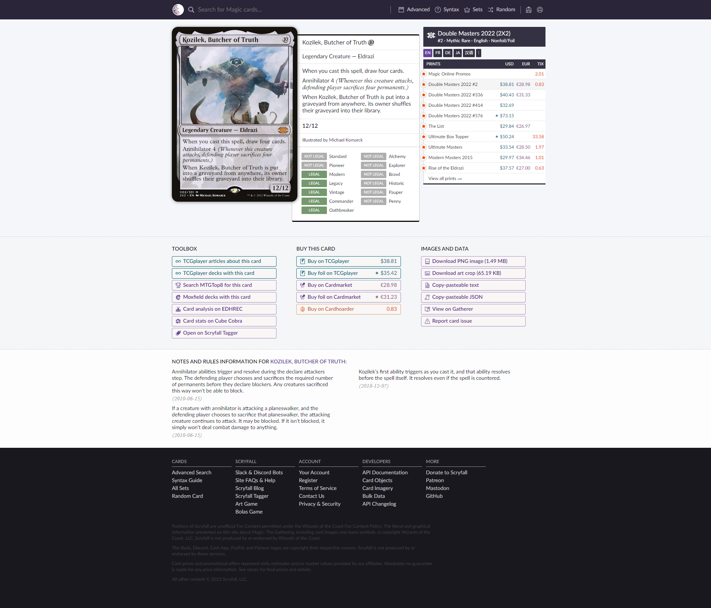
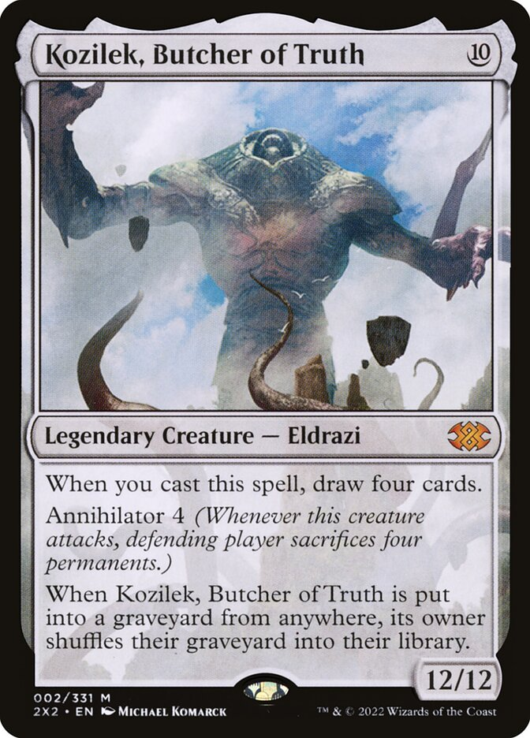
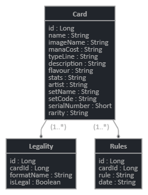

# Mtgbase

Trading card game database for practicing Spring Boot.

## Project details

This project runs on Java version 17.

Dependencies:

* Data JPA
* Thymeleaf
* Web
* H2 database
* Test
* Lombok

## Running the project

Execute the following commands inside the project folder.

1. `mvn clean install -DskipTests`
1. `mvn spring-boot:run`

## Tables

This project is based on [Scryfall MTG Search](https://scryfall.com/). There are only 3 tables:

* Cards: basic card date, such as `name`, `mana cost`, `stats`, `description`, `flavor text`, ...
* Legality: is it legal in several game formats, like `Standard`, `Commander`, `Pauper`, ...
* Rules: custom rules for given card, ordered by date

This is a [card page on Scryfall](https://scryfall.com/card/2x2/2/kozilek-butcher-of-truth), where all the data can be seen.

## Example Scryfall page

## Example card

## Data Entities

Please see [the JDL text file](docs/mtgbase.jdl)

* 